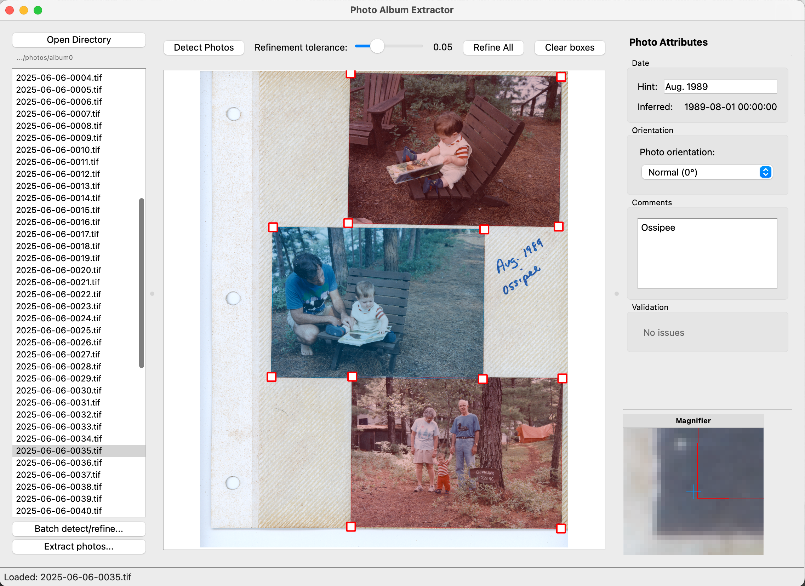

# Photo Album Extractor

A cross-platform GUI application for extracting individual photos from scanned album
pages.



## Features

- **Automatically detects photos on the page** and uses computer vision techniques to
  precisely bound each photo.
- **Works with overlapping, tilted, and rotated photos**.
- **Extracts photos** to individual JPEG files.
- **Runs locally on your machine**: can process large, high-resolution scans without
  uploading the full page to a cloud service. (photo detection does upload
  a downscaled version of each page to Google's Gemini API).
- **Automatically transcribes dates and captions** and saves these as EXIF annotations
  in the extracted files.
- **Infers EXIF dates** for unlabeled photos based on surrounding photos, to preserve
  album order.
- **Batch mode**: can preprocess a full album of pages in a single operation.
- **Graphical interface** to view and update photo boundaries and annotations.


## Installation

Using `uv` (fastest but you may need to [install
`uv`](https://docs.astral.sh/uv/getting-started/installation/) first):

```bash
# Clone the repository
git clone https://github.com/davmre/photo-album-extractor
cd photo-album-extractor

# Run the app
uv run python3 main.py
```

Using `pip/venv` (legacy approach):

```bash
# Clone the repository
git clone https://github.com/davmre/photo-album-extractor
cd photo-album-extractor

# Create and activate virtual environment
python3 -m venv venv
source venv/bin/activate

# Install dependencies
pip install -e .

# Run the app
python3 main.py
```

Windows users will need to install [git](https://git-scm.com/downloads) and
[uv](https://docs.astral.sh/uv/getting-started/installation/); then the `uv`
instructions above (at the command prompt or Powershell prompt) should work to
automatically download Python and all required dependencies and run the app.

TODO: create prepackaged installers for Windows/MacOS and common Linux distros.

## Workflow

The app works with a directory of scanned album pages as individual image files (`.tif`,
`.png`, or `.jpg` formats). Bounding boxes and other state are automatically stored in a
hidden file `.photo_extractor_data.json` in the album directory, so you can close and
re-open the album later without losing your work.

To detect photos you will need a Gemini API key, which you can get for free from [Google
AI Studio](https://aistudio.google.com/app/apikey): click "Create API Key" and follow
the prompts. As of fall 2025, the Gemini Flash free tier supports 250 requests per day
(250 album pages per day) at no charge. Once you have your API key, enter it in the app
preferences dialog.

The basic workflow is as follows:

1. **Open the album directory** you'd like to work with:

```
python3 main.py path/to/album_dir
```

2. **Run batch preprocessing** to detect photos and refine their borders:
  - You may first want to test for any configuration errors by by manually clicking
    `Detect photos` and then `Refine all` on the first album page. If this works, you
    should see boxes appear around the photos on that page.
  - To process the whole album, click the `Batch detect/refine...` button and hit `Run`.
    This will take a while (several seconds per album page).

3. **Manually correct** photo boundaries and transcribed annotations using the GUI.
  - Step through the album and spot-check that the detected boxes match the photos on the page, and that any date hints and captions are transcribed correctly.
  - An EXIF date for each photo is inferred based on album order and explicit date
  hints provided for any nearby photos. You may want to improve the inferred dates by
  providing additional date hints.
  - The app will manually flag out-of-order dates and other potential inconsistencies.
  These warnings can be customized in the app preferences (for example, if you know that
  all your photos are a certain aspect ratio, you can warn on any boxes that don't match
  that ratio). Right-click a photo to 'Mark as Good' once you've checked that a warning
  is not a problem.
  - Photo bounding boxes are constrained to be rectangular by default. There are two ways to change the angle of a rectangle:
    - Use the `Refine` feature to automatically snap to (a rectangular approximation of) a photo's edges.
    - Drag the corners individually by holding Command (MacOS) or Control (Linux/.
      Windows) while dragging to create a non-rectangular box. Then, use the
      `Rectangle-ify` option from the right-click menu to re-impose the rectangle constraint.
  - Note that the app supports photos that have non-rectangular bounds, but
  these will be distorted during extraction, since the extracted file is always
  rectangular. For non-rectangular photos it is generally better to choose a specific rectangle to extract.

4. **Extract photos** to individual files: click `Extract photos...` and then `Extract`
   in the dialog box to write each photo from the whole album (or the current page) to its own file.

Finally: you might want to **upload the extracted photos** to Google Photos or another
service. Unfortunately, Google Photos does not display photo captions recorded in EXIF
metadata. As a workaround, I created a [script](https://github.com/davmre/photos_uploader) to upload photos using the Google
Photos API while setting the description field to match EXIF captions if present. You
can try using that if you'd like your captions to display in Google Photos.

## Contributing

Feel free to submit pull requests for new features, bugfixes, etc. Please ensure that any new code

1. Has type annotations and typechecks with `pyright`.
2. Passes linting (`ruff format .`, `ruff check . --fix`).
3. Passes existing tests (`pytest tests/`)
4. Adds tests for new functionality as appropriate.

Since I have limited bandwidth for maintainance, please open an issue before starting
any nontrivial development, so we can assess the approach and if this is something I'm
likely to be able to support.

A sizable chunk of the codebase was (co-)written with Claude Code. The `CLAUDE.md`
file has some advice on navigating the code; I'd recommend reading it as a human
comtributor as well. If you can get Claude or another AI system to implement a useful change, feel free to submit it, *after* first reviewing the AI code
yourself - please don't ask me to spend my time reading code you can't personally vouch for!